# 👽 Mini Projeto 02 — Central de Comunicações Alienígenas

> **Projeto prático de manipulação de strings em C**
>
> Este README documenta o funcionamento do código desenvolvido para a Central de Comunicações Alienígenas, destacando a organização das funções, o fluxo de execução e as principais decisões de implementação.

---

## 👥 Integrantes

| Integrante | Participação |
|---|---|
| **João Vitor dos Santos e Sousa** | Desenvolvimento e implementação |
| **Lucas Cristiano Soares Lino** | Desenvolvimento e implementação |

---

## 📡 Visão geral do projeto

A **Central de Comunicações Alienígenas** recebe uma mensagem textual e permite aplicar uma sequência de transformações sobre ela.

Cada transformação é representada por um código numérico:

| Código | Operação | Parâmetro |
|---:|---|---|
| `1` | Inverter mensagem | Não |
| `2` | Deslocar caracteres | Inteiro `n` |
| `3` | Trocar pares e ímpares | Não |
| `4` | Inverter maiúsculas/minúsculas | Não |
| `5` | Rotacionar mensagem | Inteiro `n` |
| `6` | Trocar metades | Não |
| `0` | Finalizar protocolo | Não |

O ponto principal do projeto é que as operações são **sequenciais**: cada função modifica o estado atual da mensagem, e a próxima operação trabalha sobre esse novo estado.

### Fluxo geral

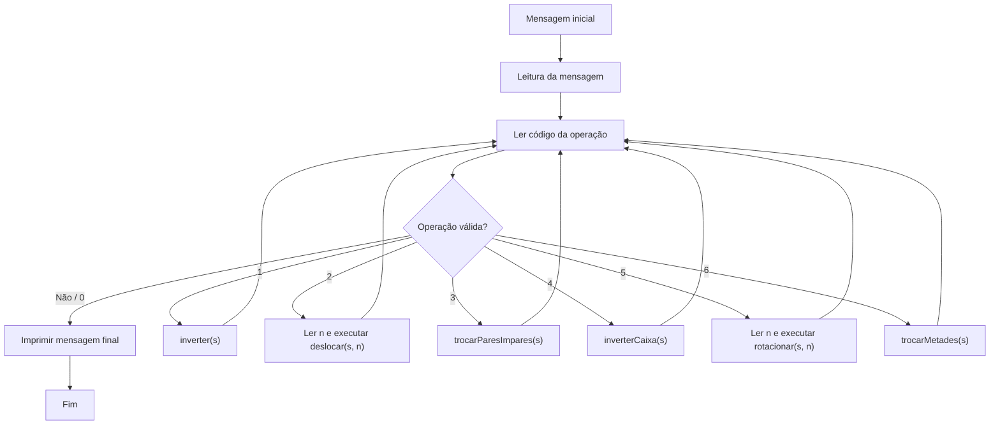

---

## 🧭 Arquitetura do programa

A função `main` foi utilizada como **controladora do fluxo**. As manipulações da mensagem ficam separadas em funções próprias.

A mensagem é armazenada em um vetor de `char`, e um ponteiro é utilizado para apontar para seu primeiro elemento:

```c
char string[10001];
char *s = string;
```

Assim, as funções recebem a mensagem através de um ponteiro:

```c
void inverter(char *s);
void deslocar(char *s, int n);
void trocarParesImpares(char *s);
void inverterCaixa(char *s);
void rotacionar(char *s, int n);
void trocarMetades(char *s);
```

### Mapa de dependências

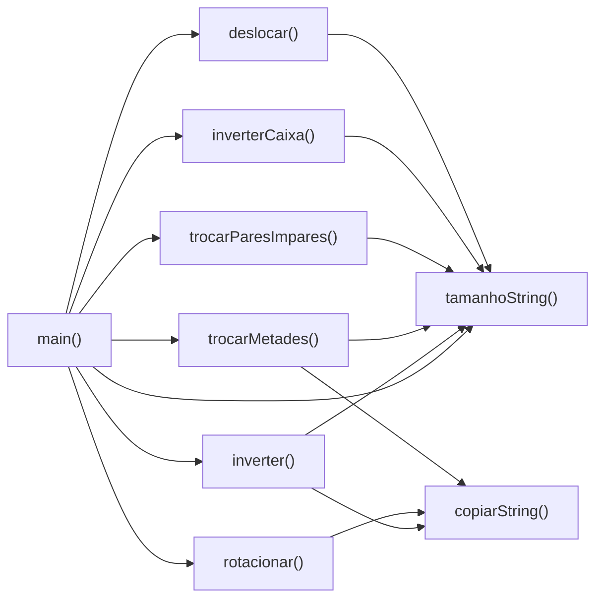

---

# 🧩 Funções auxiliares

## `tamanhoString(char *s)`

Essa função é uma implementação manual do comportamento equivalente ao `strlen`, sem utilizar `string.h`.

### Funcionamento

A função percorre a string enquanto o caractere apontado for diferente de `'\0'`.

```c
while (*(s + i) != '\0')
```

A cada caractere encontrado, o contador `tamanho` é incrementado.

### Exemplo visual

Para:

```text
A L I E N \0
0 1 2 3 4  5
```

A função retorna:

```text
5
```

### Fluxo

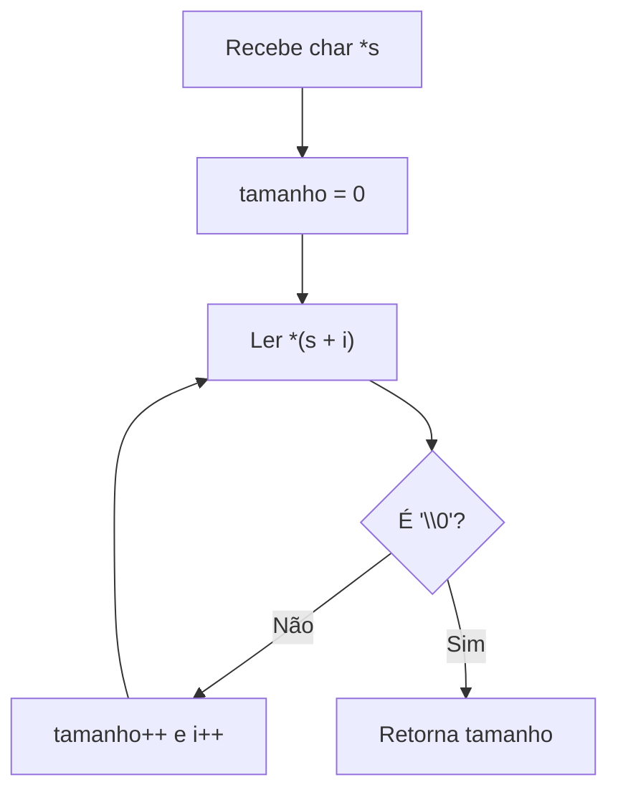

---

## `copiarString(char *atual, char *destino)`

Realiza a cópia de uma string para outra utilizando ponteiros.

A função percorre a string de origem e copia cada caractere para a posição correspondente no destino. Ao final, também copia o terminador `'\0'`.

### Fluxo

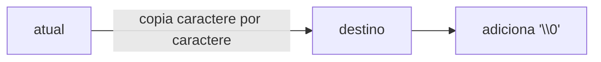

Essa função é utilizada principalmente por:

- `inverter`
- `rotacionar`
- `trocarMetades`

---

# 🔄 Operações principais

## 1. `inverter(char *s)`

Inverte a ordem dos caracteres da mensagem.

### Estratégia utilizada

Em vez de trocar os caracteres diretamente dentro da string, a implementação cria um vetor auxiliar:

```c
char invertida[10001];
```

Depois, percorre a string original do início ao fim e grava cada caractere na posição correspondente do vetor auxiliar, começando pelo final.

### Exemplo

```text
Original:
A B C D E F

Índices:
0 1 2 3 4 5

Resultado:
F E D C B A
```

### Visualização

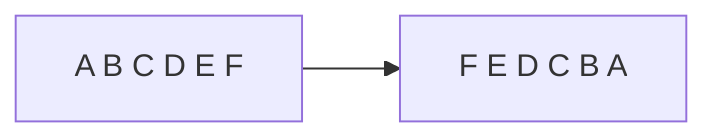

A função termina copiando `invertida` de volta para `s`.

### Complexidade

- Tempo: **O(n)**
- Memória auxiliar: **O(n)**

---

## 2. `deslocar(char *s, int n)`

Desloca letras e números de forma circular.

O comportamento é separado em três grupos:

```text
A-Z  → alfabeto maiúsculo
a-z  → alfabeto minúsculo
0-9  → números
```

Pontuações e outros símbolos permanecem inalterados.

### Deslocamento positivo

Para `n > 0`, cada caractere é avançado.

Exemplo com `n = 2`:

```text
A → C
B → D
Y → A
Z → B
```

Para números:

```text
8 → 0
9 → 1
```

### Deslocamento negativo

Quando `n < 0`, o código transforma o valor em positivo e realiza o deslocamento no sentido contrário.

Exemplo:

```text
C com n = -2 → A
A com n = -1 → Z
1 com n = -1 → 0
0 com n = -1 → 9
```

### Preservação de caixa

```text
A → B
Z → A

a → b
z → a
```

Ou seja, letras maiúsculas continuam maiúsculas e letras minúsculas continuam minúsculas.

### Fluxo

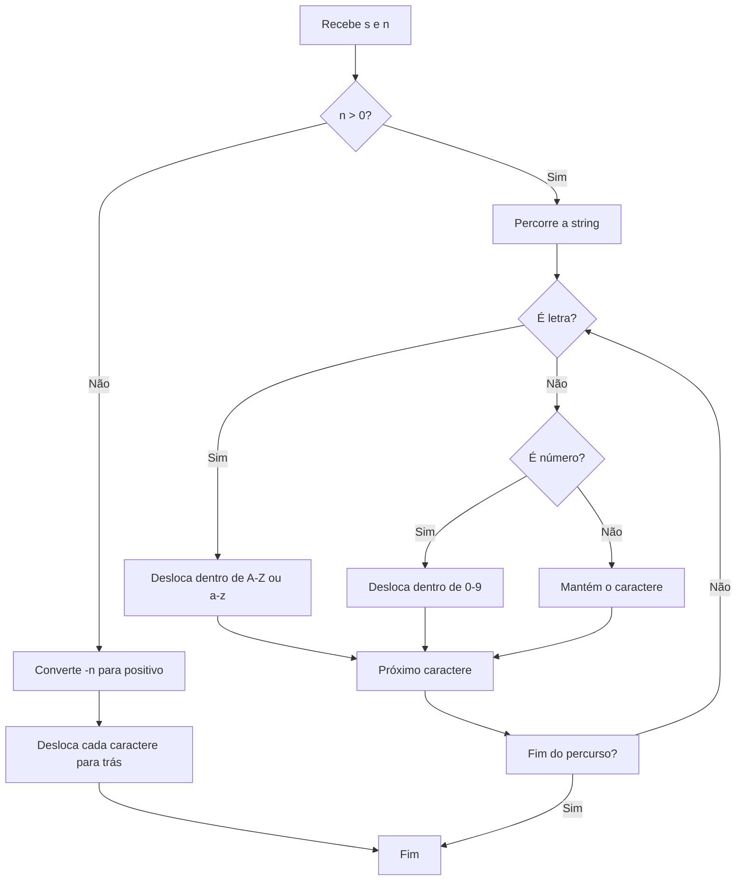

### Exemplo completo

```text
Entrada:
AdkWa-slZ (mSa) 19.01?

n = 2

Saída:
CfmYc-unB (oUc) 31.23?
```

### Observação sobre implementação

A implementação atual realiza o deslocamento repetindo a alteração caractere por caractere dentro de um laço baseado em `n`. Isso funciona para os casos previstos, mas valores absolutos muito grandes de `n` podem aumentar desnecessariamente a quantidade de iterações.

---

## 3. `trocarParesImpares(char *s)`

Troca caracteres em pares consecutivos:

```text
posição 0 ↔ posição 1
posição 2 ↔ posição 3
posição 4 ↔ posição 5
...
```

### Exemplo

```text
A B C D E F
↓ ↓ ↓ ↓ ↓ ↓
B A D C F E
```

Resultado:

```text
ABCDEF → BADCFE
```

### Caso de tamanho ímpar

O último caractere não possui um parceiro e permanece no mesmo local:

```text
ABCDE → BADCE
```

### Fluxo

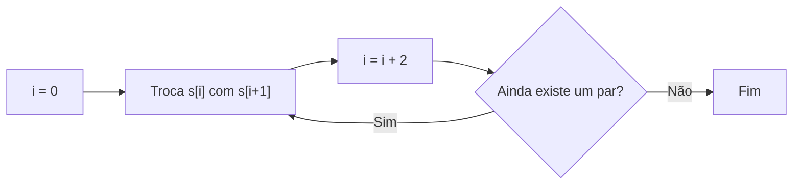

A variável temporária `temp` é usada para evitar perda do valor durante a troca.

---

## 4. `inverterCaixa(char *s)`

Inverte apenas a caixa das letras:

```text
Maiúscula → minúscula
Minúscula → maiúscula
```

Caracteres que não são letras permanecem iguais.

### Exemplo

```text
Alien 42!

↓

aLIEN 42!
```

### Estratégia

Como a entrada é garantida em ASCII, o código utiliza a diferença entre os códigos de maiúsculas e minúsculas:

```text
'a' - 'A' = 32
```

Assim:

```text
'A' + 32 → 'a'
'a' - 32 → 'A'
```

### Visualização

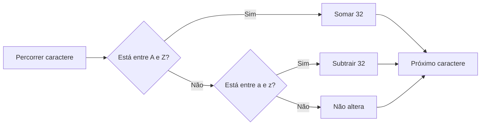

---

## 5. `rotacionar(char *s, int n)`

Rotaciona a mensagem inteira, deslocando **todos os caracteres**, inclusive espaços e pontuações.

Ao ultrapassar uma extremidade, o caractere reaparece na extremidade oposta.

### Exemplo positivo

Para `n = 2`:

```text
A B C D E F
↑ ↑ ↑ ↑ ↑ ↑

        A B C D
E F

Resultado:
E F A B C D
```

Ou:

```text
ABCDEF → EFABCD
```

### Rotação negativa

O código trata valores negativos convertendo inicialmente o deslocamento para um valor positivo e, em seguida, transformando esse valor em uma rotação equivalente para a direita.

Por exemplo:

```text
n = -2
```

em uma string de tamanho 6 é equivalente a:

```text
n = 4
```

pois:

```text
6 - 2 = 4
```

### Redução de valores grandes

Quando `n > tamanho`, é utilizado:

```c
n = n % tamanho;
```

Isso reduz a rotação para o intervalo necessário.

### Papel da cópia auxiliar

A função cria:

```c
char copia[10001];
```

antes de mover os caracteres.

Isso é importante porque cada posição da nova string depende do conteúdo **original**, e não de um caractere que já tenha sido movido.

### Visualização

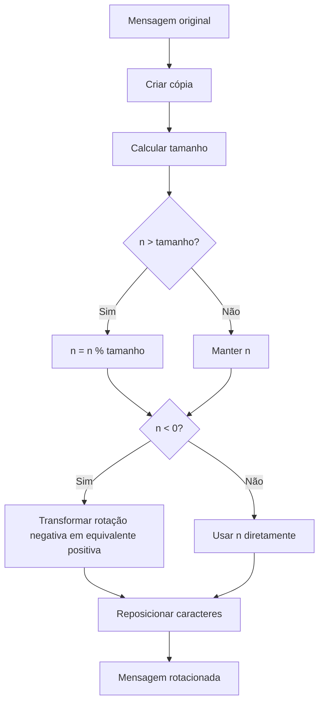

---

## 6. `trocarMetades(char *s)`

A intenção da operação é trocar a primeira metade da mensagem com a segunda metade.

### Tamanho par

Para:

```text
ABCDEF
```

temos:

```text
Primeira metade: ABC
Segunda metade: DEF
```

Resultado esperado:

```text
DEFABC
```

### Tamanho ímpar

Para:

```text
ABCDE
```

o caractere central fica parado:

```text
AB | C | DE
```

e o resultado esperado é:

```text
DE | C | AB
```

ou seja:

```text
DECAB
```

### Regra visual

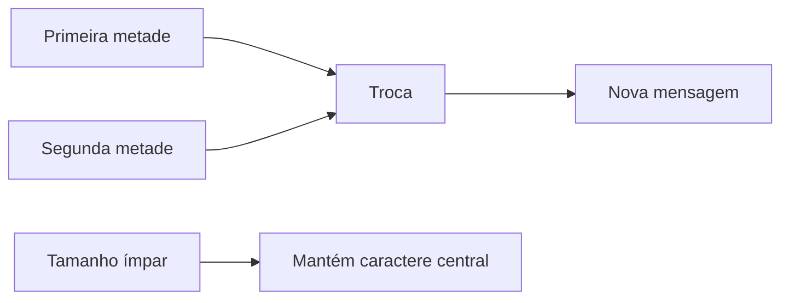

---

# 🧠 Fluxo da `main()`

A `main` é responsável por controlar a execução do protocolo.

### Etapas

1. Declara o vetor que armazenará a mensagem.
2. Lê a mensagem inicial.
3. Cria o ponteiro `s` apontando para a mensagem.
4. Lê continuamente o código da operação.
5. Quando necessário, lê também o parâmetro `n`.
6. Chama a função correspondente.
7. Quando a operação é `0`, imprime a mensagem final e encerra.

### Fluxo detalhado

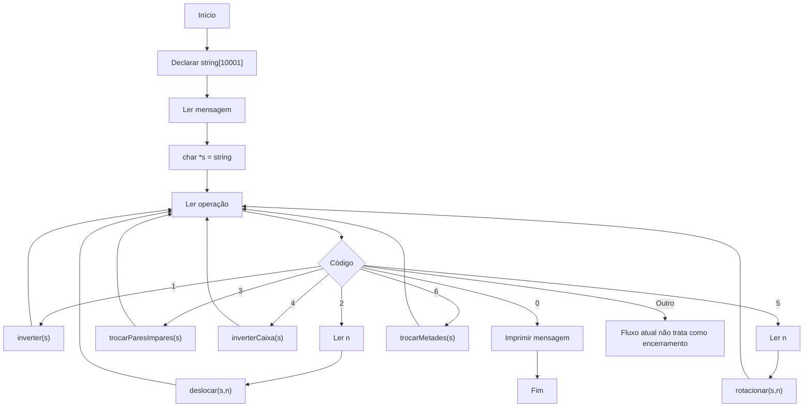

---

# 🔗 Como as operações são encadeadas

O programa não cria uma nova mensagem para cada operação principal. As funções alteram diretamente a mensagem apontada por `s`.

Por exemplo:

```text
Mensagem:
ATAQUE AO AMANHECER

Operação 1:
RECEHNAMA OA EUQATA

Operação 4:
recehnama oa euqata
```

A ideia pode ser representada como uma cadeia:


Esse modelo permite combinar operações em qualquer ordem.

---

# 🧪 Exemplos de execução

## Exemplo 1

### Entrada

```text
ATAQUE AO AMANHECER
1
4
0
```

### Passo 1 — Operação `1`

```text
ATAQUE AO AMANHECER
↓
RECEHNAMA OA EUQATA
```

### Passo 2 — Operação `4`

```text
RECEHNAMA OA EUQATA
↓
recehnama oa euqata
```

### Saída

```text
recehnama oa euqata
```

---

## Exemplo 2

### Entrada

```text
Mensagem Secreta 2026!
2 3
1
0
```

### Operação `2 3`

Cada letra/número avança três posições:

```text
Mensagem Secreta 2026!
↓
Phqvdjhp Vhfuhwd 5359!
```

### Operação `1`

A mensagem é invertida:

```text
Phqvdjhp Vhfuhwd 5359!
↓
!9535 dwhufhV phjdvqhP
```

### Saída

```text
!9535 dwhufhV phjdvqhP
```

---

# 📥 Formato de entrada

O programa espera:

### 1. Primeira linha

A mensagem inicial, com até 10.000 caracteres.

### 2. Operações

Inteiros que indicam qual transformação deve ser executada.

Para as operações `2` e `5`, o próximo inteiro representa `n`.

Exemplo:

```text
Minha mensagem
2 3
4
5 -2
1
0
```

Isso representa:

```text
Mensagem
  ↓
Deslocamento +3
  ↓
Inverter caixa
  ↓
Rotação -2
  ↓
Inversão
  ↓
Mensagem final
```

---

# 📤 Formato de saída

A saída deve conter **somente a mensagem final**, seguida de uma quebra de linha.

Não devem ser exibidos menus ou mensagens como:

```text
Digite uma opção:
Escolha uma operação:
Resultado:
```

---

# 🛠️ Compilação e execução

Considerando que o código esteja salvo como `main.c`:

### Linux / macOS

```bash
gcc main.c -o central_comunicacoes
./central_comunicacoes
```

### Com avisos do compilador

Uma opção recomendada durante o desenvolvimento é:

```bash
gcc -Wall -Wextra -pedantic main.c -o central_comunicacoes
```

Isso ajuda a identificar variáveis não utilizadas, conversões suspeitas e outros possíveis problemas.

---

# 📐 Decisões de implementação

## Uso de ponteiros

As operações recebem `char *s`, permitindo modificar diretamente a mensagem original.

Por exemplo:

```c
void inverterCaixa(char *s)
```

Quando a função altera:

```c
*(s + i)
```

ela está alterando diretamente o caractere armazenado no vetor original.

---

## Ausência de `string.h`

O projeto não utiliza funções prontas de `string.h`.

Para isso, foram implementadas funções próprias, principalmente:

```text
tamanhoString()
copiarString()
```

Esse procedimento permite estudar e aplicar manipulação manual de strings e aritmética de ponteiros.

---

## Uso de vetores auxiliares

Algumas operações precisam preservar o conteúdo original enquanto reorganizam os caracteres.

Foram utilizados vetores temporários de tamanho máximo:

```c
char invertida[10001];
char copia[10001];
char atual[10001];
```

Como o enunciado limita a mensagem a 10.000 caracteres, existe espaço também para o terminador `'\0'`.

---

## Tratamento de ASCII

As funções de deslocamento e inversão de caixa trabalham diretamente com os intervalos ASCII:

```text
'A' até 'Z'
'a' até 'z'
'0' até '9'
```

Isso é coerente com a garantia de que a entrada utiliza somente a tabela ASCII padrão.

---

## Tratamento de números e letras em `deslocar`

A função separa o processamento em três casos:

```text
Letra maiúscula → mantém no intervalo A-Z
Letra minúscula → mantém no intervalo a-z
Número           → mantém no intervalo 0-9
```

Qualquer outro caractere não sofre alteração.

---

## Tratamento de rotação negativa

Na função `rotacionar`, valores negativos são convertidos em uma rotação equivalente positiva.

Para uma string de tamanho `L`:

```text
rotação -n  ≡  rotação (L - n)
```

após a normalização adequada de `n`.

Isso permite utilizar uma única lógica de reposicionamento dos caracteres.

---

# ⏱️ Complexidade aproximada

Considerando `n` como o tamanho da mensagem:

| Função | Complexidade aproximada | Espaço auxiliar |
|---|---:|---:|
| `tamanhoString` | O(n) | O(1) |
| `copiarString` | O(n) | O(1) |
| `inverter` | O(n) | O(n) |
| `deslocar` | O(n · \|n\|) na implementação atual | O(1) |
| `trocarParesImpares` | O(n) | O(1) |
| `inverterCaixa` | O(n) | O(1) |
| `rotacionar` | O(n) | O(n) |
| `trocarMetades` | O(n) | O(n) |

> **Observação:** na linha da função `deslocar`, `n` representa o parâmetro de deslocamento, enquanto na tabela `n` também é usado informalmente para representar o tamanho. A ideia é destacar que o custo atual cresce proporcionalmente ao valor absoluto do deslocamento.

---

# 🚀 Estrutura resumida

```text
Central de Comunicações Alienígenas
│
├── main()
│   ├── lê mensagem
│   ├── recebe operações
│   ├── lê parâmetros quando necessário
│   └── controla o protocolo
│
├── Funções auxiliares
│   ├── tamanhoString()
│   └── copiarString()
│
└── Operações
    ├── inverter()
    ├── deslocar()
    ├── trocarParesImpares()
    ├── inverterCaixa()
    ├── rotacionar()
    └── trocarMetades()
```

---

## 📝 Conclusão

O projeto utiliza uma estrutura modular para transformar uma mensagem por meio de operações independentes sobre strings. A separação das funções facilita a leitura do código, a reutilização das rotinas auxiliares e a realização de testes individuais.

O uso de ponteiros permite que as operações modifiquem diretamente a mensagem armazenada na `main`, enquanto as funções auxiliares evitam dependência das rotinas prontas de `string.h`.

Os diagramas e exemplos deste README têm o objetivo de facilitar a compreensão do fluxo de dados e da transformação da mensagem em cada etapa do protocolo.
